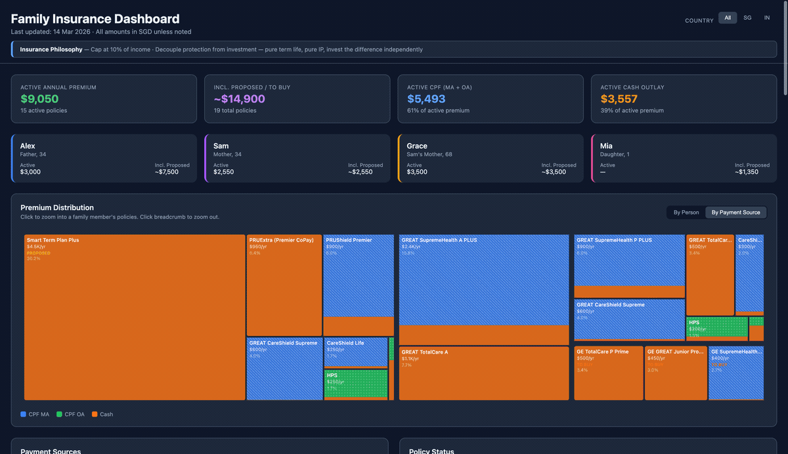
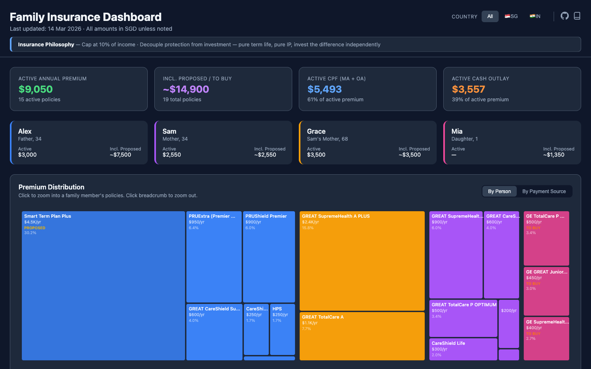
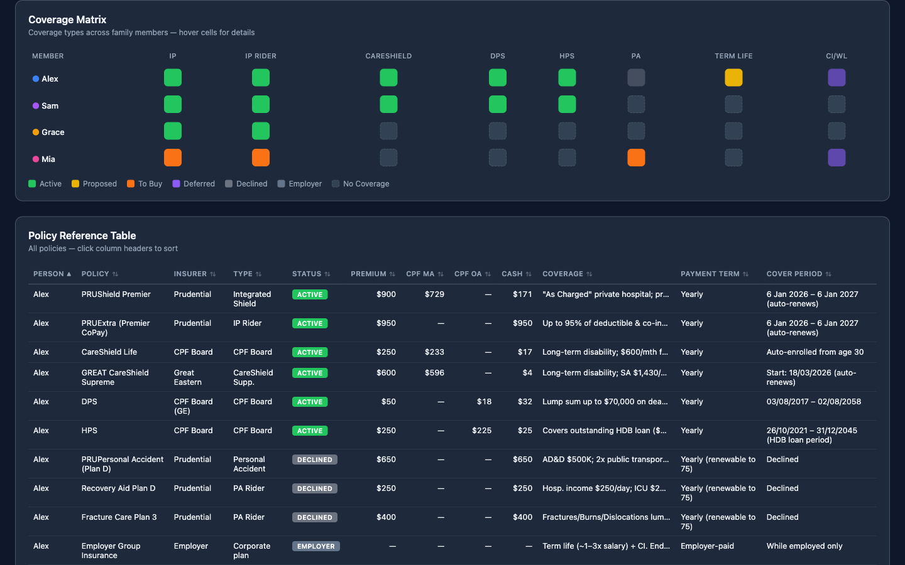

# Family Insurance Dashboard Template

A complete insurance portfolio management system built with Markdown + D3.js + Claude Code.

**[Live Demo](https://insurance.prasanth.io/Family%20Insurance%20Dashboard.html)** | **[GitHub Repo](https://github.com/prasanth-ntu/insurance-dashboard-template)** | **[Blog Post](https://prasanth.io/posts/2026-03-14-What-My-Dad-Taught-Me-About-Insurance)**

Track your family's insurance policies in a structured Markdown file, visualize them in an interactive dashboard, and keep everything in sync with a single command.

## What's Included

- **`Family Insurance Overview.md`** — Structured Markdown template for tracking all family insurance policies (premiums, CPF splits, coverage periods, status)
- **`Family Insurance Dashboard.html`** — Interactive D3.js dashboard with 9 visualizations:
  - Summary cards & person cards
  - Premium distribution treemap
  - Stacked bar chart (by payment source)
  - Policy status donut chart
  - Benefit coverage matrix
  - 35-year premium projection
  - Coverage timeline (Gantt chart)
  - Coverage matrix heatmap
  - Sortable/filterable reference table
- **`sync-insurance` skill** — Claude Code skill that syncs policy data from Markdown → Dashboard with one command

## Live Demo

**[Try the interactive dashboard](https://insurance.prasanth.io/Family%20Insurance%20Dashboard.html)** (with anonymized sample data)

## Screenshots





## Getting Started

### Prerequisites
- [Claude Code](https://docs.anthropic.com/en/docs/claude-code) (for the sync skill)
- A modern web browser (for the dashboard)

### Setup

1. Clone this repo:
   ```bash
   git clone https://github.com/YOUR_USERNAME/insurance-dashboard-template.git
   cd insurance-dashboard-template
   ```

2. Edit `Family Insurance Overview.md` with your family's insurance details:
   - Update family member names and ages
   - Add your policies to the markdown tables
   - Follow the existing table structure (columns must match)

3. Open `Family Insurance Dashboard.html` in your browser to see the sample data

4. Sync your changes:
   ```bash
   # In Claude Code, run:
   /sync-insurance
   ```
   This reads your markdown, extracts policy data, and updates the dashboard automatically.

## How It Works

```
Family Insurance Overview.md  ──→  /sync-insurance  ──→  Family Insurance Dashboard.html
       (source of truth)            (Claude Code)              (interactive dashboard)
```

- **Markdown is the source of truth** — edit policies here
- **Dashboard is auto-generated** — never edit the `policies` array manually
- **Sync validates** — checks policy counts, premium totals, and CPF splits match

## Customization

### Adding a family member
1. Add a new section in the markdown with their policies
2. Add their name to the `persons` array and `personColors` in the HTML
3. Add their DOB to `personDOB` in the HTML
4. Run `/sync-insurance`

### Policy status annotations
Use these in the markdown Plan column:
- `*(proposed)*` — Under consideration
- `*(to buy)*` — Committed, not yet purchased
- `*(deferred)*` — Postponed to a future date
- `~~*(proposed)*~~ *(declined)*` — Was proposed, now declined

## Recommended Claude Code Skills

This template includes the `sync-insurance` skill, but you can enhance your workflow with additional community skills:

### Installing skills

```bash
# Install official Anthropic skills (includes pdf, docx, and more)
claude install-skill https://github.com/anthropics/skills

# Install community skills from awesome-claude-skills
claude install-skill https://github.com/BehiSecc/awesome-claude-skills
```

### Useful skills for insurance management

| Skill | What it does |
|-------|-------------|
| **pdf** | Read and extract text/tables from policy brochures, certificates, and benefit schedules |
| **docx** | Generate Word documents (e.g., insurance summary reports for your financial advisor) |
| **sync-insurance** (included) | Sync markdown policy data to the interactive dashboard |

**Tip:** Drop a policy PDF into your project folder and ask Claude to "extract the key coverage details from this brochure and add them to my insurance overview." The `pdf` skill will handle the extraction, and you can then run `/sync-insurance` to update the dashboard.

Browse more skills:
- [anthropics/skills](https://github.com/anthropics/skills) — Official Anthropic skills
- [awesome-claude-skills](https://github.com/BehiSecc/awesome-claude-skills) — Community-curated collection

## Built With

- [D3.js v7](https://d3js.org/) — All visualizations
- [Claude Code](https://docs.anthropic.com/en/docs/claude-code) — Sync skill automation
- [Claude Code Skills](https://github.com/anthropics/skills) — Extensible skill ecosystem
- Vanilla HTML/CSS/JS — No build tools needed

## Context

This template was born from a personal journey of trying to understand insurance. Read the full story: [What My Dad Taught Me About Insurance](https://prasanth.io/posts/2026-03-14-What-My-Dad-Taught-Me-About-Insurance)

## Contributing

Contributions welcome! Some ideas:

- **Country adaptations** — Adapted this for Australia, UK, US, or another country's insurance system? Submit a PR with a sample data variant
- **New visualizations** — Ideas for charts or views that would help families understand their coverage
- **Bug fixes & improvements** — See something off? Open an issue or PR

No formal process — just open a PR and describe what you changed.

## License

MIT
